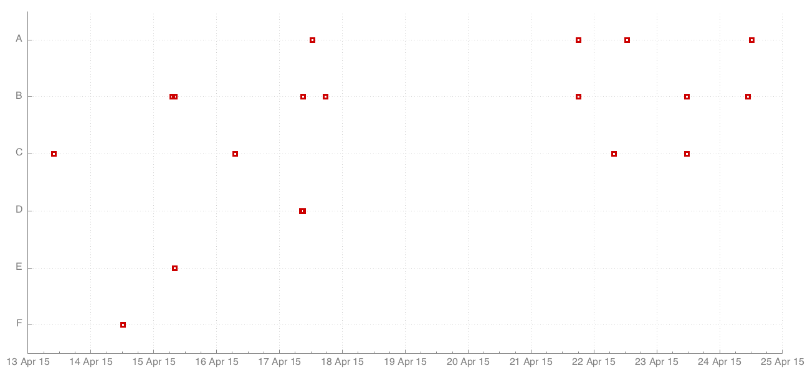

visualisation-utils
===================

a collection of scripts for standard visualisation tasks

Installing
==========

`gnuplot` is required for these scripts to work.

The installation depends on your platform, e.g. for Linux:

~~~ .bash
sudo apt-get install gnuplot
~~~

Then you can install the actual visualisation-utils gem:

~~~ .bash
gem install visualisation-utils
~~~

scatter-plot
============

Prints scatter plots of one or more columns of whitespace separated data using
gnuplot as a backend.

~~~ .bash
cat | scatter-plot <<'END'
1 1
2 4
3 9
4 16
5 25
END
~~~

This incantation will bring up the gnuplot gui with the following graph:

time-line
=========

The `time-line` tool visualises events in a time-line.
The data is expected in two columns, a timestamp and an
event name. The default time format is `%Y-%m-%dT%H:%M:%S`.

Here is a simple example:

~~~~
time-line \
    --dimensions 1300,600 \
    -o time-line.png <<'END'
2015-04-24T12:21:32 A
2015-04-24T10:42:35 B
2015-04-23T11:36:26 B
2015-04-23T11:36:26 C
2015-04-22T12:38:54 A
2015-04-22T07:46:29 C
2015-04-21T18:02:01 B
2015-04-21T18:02:01 A
2015-04-17T17:35:21 B
2015-04-17T12:33:23 A
2015-04-17T09:04:37 D
2015-04-17T09:04:37 B
2015-04-17T08:29:31 D
2015-04-16T07:03:51 C
2015-04-15T07:57:23 E
2015-04-15T07:57:23 B
2015-04-15T07:04:13 B
2015-04-14T12:22:07 F
2015-04-13T09:52:25 C
END
~~~~

It yields the following graph:

heat-map
========

Prints a heat map visualising the distribution of
geo coordinate samples.

~~~ .bash
cat | heat-map <<'END'
38.6,-90.5
38.6,-90.5
40.5,-74.3
34.4,-92.2
42.5,-83.0
34.1,-92.0
33.3,-111.9
34.1,-91.8
34.2,-86.8
END
~~~

This will render to the following visualisation:

TODO
====

- [X] Overriding of autoscale
- [X] Create nice PNGs
- [X] Line plots
- [ ] Changing changing the size of the dots
- [X] Secondary y-axis
- [ ] Bar chart single series
- [ ] Bar chart multiple series
- [X] Discrete y-values, e.g. to visualise events over time
- [ ] Histogram plotting

